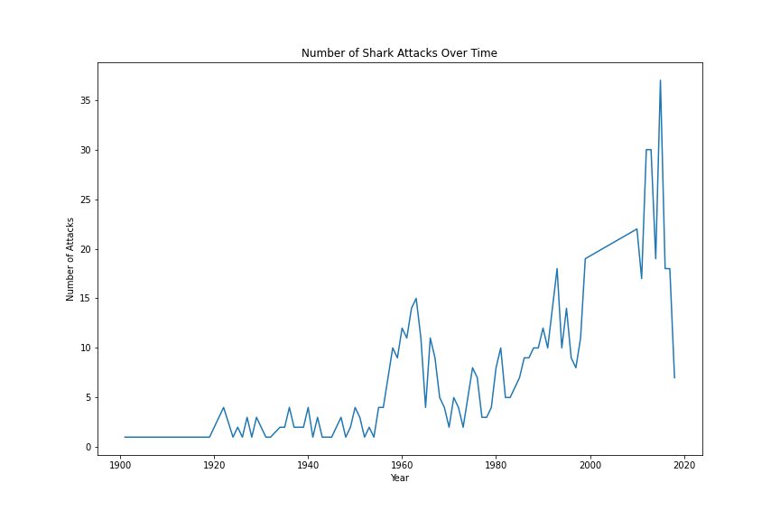

# myproject
~

## Data Exploration: 

~
 
 I actually didnt have a clear hypothesis in mind when I began cleaning the data. I wantd to to explore the data as much as possible before hopefully finding an interesting relationship between some of the variables and the creating a hypothesis. I wanted to be able to create visuals that were "intersting" The problem with this is that without a clear hypothesis in mind and without specific visuals already in mind, the cleaning process was almost never ending. There was always something more to clean!
 
 The lesson from this is that when dealing with data that is especially "messy" it is important to have a clear purpose in mind which will inform the cleaning process. I.E Know what it is that you want to prove / disprove and then just focus on the data that is relevant for the testing of your chosen hypothesis and for the creation of the specific visuals that will support this.
 
 As someone who is quite afraid of sharks, I wanted to explore the factors that increase the probability of shark attack. (So I know what to avoid :-)

~

## Data Cleaning:

~

I spent a lot of time cleaning and re-cleaning but the key steps that I took where these:

Removing columns that were completely irrelevant or unesful for any data exploration.
Removing rows with NaN values 
Cleaning the rows in the remaining colums:
- Ensuring that all values had a consistent format
- Ensuring that the data in the column was the most appropriate data type for the purpose of data exploration with that variable. 
- Removing any problematic rows

I ordered the rows by date (ascending) as this seemed most intuitive to me. 
I then set a new index (beginning at 1) for the earliest historical attack .

I regrouped the columns into an order that seemed more logical to me. 

~

## My Visuals:

~

My first visual is a pie chart wich shows the proportion of Fatal Shark Attacks. As we can see, about 1 in 5 shark attacks are fatal. 

My next visual is an age distribution of Shark Attack Victims. We can see that most victims are between the ages of 15 and 25. I think that this is probably because these age groups spend the most time in the water. 

Here we have a bar chart showing shark attacks by country. By far the most dangerous countries in terms of shark attacks are USA, Australia and South Africa. 

My next visual is a bar chart showing shark attacks by activity. We can see that by far the most dangerous activities are surfing, swimming and spearfishing; in that order. 

Next up we have a bar chart showing Shark Attacks by Hour of Day. We can see that most attacks happen during the daytime, which is interesting because sharks are apparently more active hunters during the night. This is likely because people are much more likely to be in the water during the day and therefore most interactions with sharks happen during this time. 

Next we can see a bar chart showing shark attacks by month. I also included sub columns to show the proportion of fatal and non-fatal attacks. It appears that shark attacks are more fatal in the Northern Hemisphere winter months. I believe that this is because a lot of the worst attacks happen in the Atlantic Ocean which is very cold in these months. The cold weather probably increases the chance of the victims dying. 

Finally we have a line chart showing the number of shark attacks over time. It seems that the number of shark attacks is increasing over time. However this could be because of several reasons:
-Perhaps record keeping is improving over time and maybe there were many shark attacks in earlier years that were not recorded.
-The number of people that swim and surf is also increasing, which creates more possibility for interactions with sharks. 

Or perhaps sharks are becoming more agressive!

~

## In conclusion and reccomendations:

.

If you want to avoid dying from a shark attack:

- Dont swim in the USA, Australia or South Africa. 
- Avoid swimming or spearfishing.
- Do not go surfing!
- If you have to do any of these things, its better to do it during summer months so that if you do get attacked, you dont die of hypothermia. 
